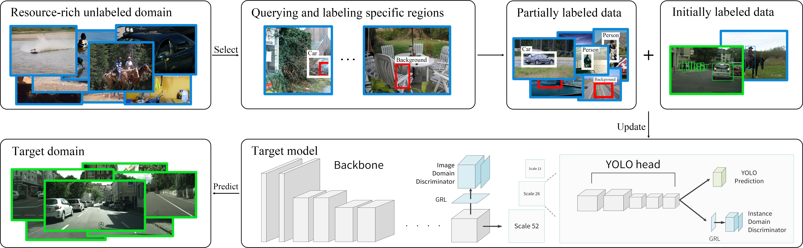
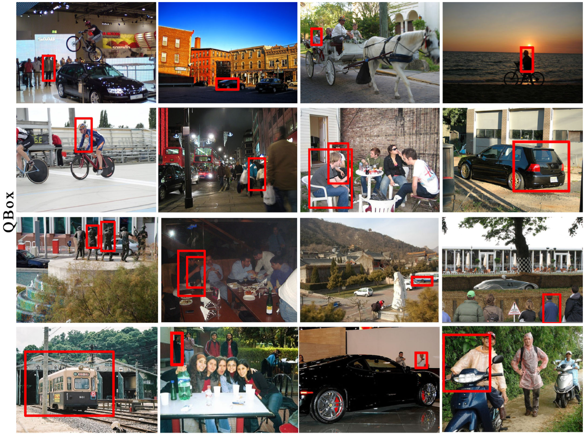
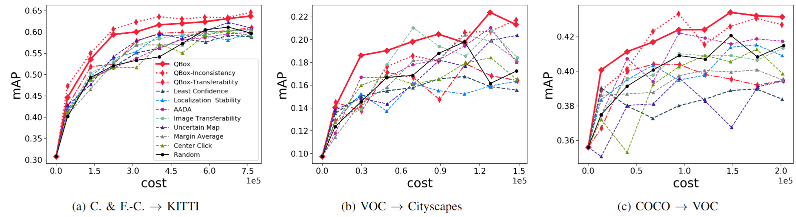
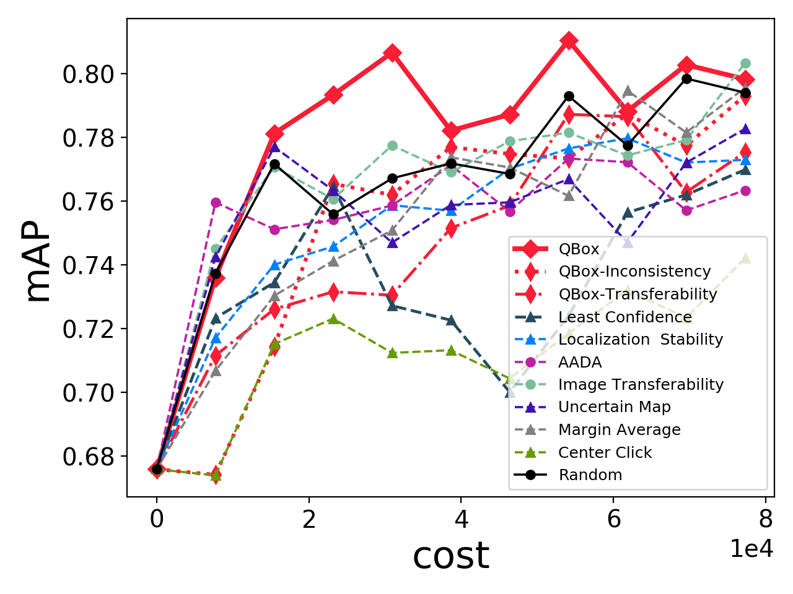

## QBox: Partial Transfer Learning with Active Querying for Object Detection

Authors: Ying-Peng Tang, Xiu-Shen Wei, Borui Zhao, Qi Qian, and Sheng-Jun Huang

This repository is the official PyTorch implementation of paper "QBox: Partial Transfer Learning with Active Querying for Object Detection". (**This work is under reviewing, please do not distribute the code.**)



QBox is an active learning method for partial transfer object detection task. It is able to query a batch of regions with high potential value to improve the model from the oracle. At each iteration, a batch of unlabeled examples and the corresponding regions for querying (red boxes) will be actively selected from the resource-rich source domain according to the proposed criterion. Specifically, for each queried region, if it is a foreground, the annotator will provide the bounding box and class label for the object (white boxes). Otherwise, a simple verification that the region is background will be given. In order to better utilize the training data collected from source domain, adversarial domain discriminator branches (colorized in celeste) are added after backbone and multi-scale prediction heads of the vanilla YOLOv3 model. (Best viewed in color).

## Main requirements

* **torch == 1.2.0**
* **torchvision == 0.4.0**
* **Python 3.7**

## Environmental settings

This repository is developed using python **3.7** on Ubuntu **16.04.5 LTS**. The CUDA nad CUDNN version is **10.0.130** and **7.5.0** respectively. We use **two NVIDIA 1080ti GPU cards** for training and testing. Other platforms or GPU cards are not fully tested. Note that the program is written for multiple cards, and the batch size is fixed as 32, so make sure your server has **at least two cards**, and the sum of the GPU memory is larger than 22GB.

## Pretrain models

The weights of pretrained model (darknet53 weights) can be downloaded by the script in weights/download_yolov3_weights.sh

For the COVID-19 dataset, we further pre-train the model on two other datasets. We use the data in \url{https://github.com/rsummers11/CADLab/tree/master/Lung_Segmentation_XLSor} and \url{https://www.kaggle.com/yoctoman/shcxr-lung-mask}}. The pretrained model parameters are availabel at [BaiduNetDisk](https://pan.baidu.com/s/1NwfNvTWggPd0TvCYJmrsXw) (fetch code is 'if3f') or [GoogleDrive](https://drive.google.com/file/d/1GTFO4AKnAUKXDevH9WPuyKlIBLvEVGZl/view?usp=sharing).

## Usage

1. Following the [guidelines](preparation.md) to prepare the data and config files. **Note that the data split and other setting files used in the experiments are already put into the 'cfg', 'data' and 'data_split' folder.**

2. Run the active learning main loop (train/test/eval).

```bash
# the --dataset option determines which setting will be used. If a new dataset is used, please modify the qbox_main.py and config.py files accordingly.
python qbox_main.py --dataset kitti --data-split-dir /data/dataset/ --save-dir /data/saved_model/ --al-save-dir /data/saved_al/
```

## Running time

when the program runs on HDD and a single $2080$Ti graphic card with batch size $16$, the training speed is $1.733$ batches per second ($1.98$ for the vanilla YOLOv3 model), and the inference speed is $7.80$ batches per second.

## Results

Here are some examples of the qureied regions on the VOC to Cityscapes task. our method can exploit the transferable and uncertain instances resoundingly, which include tiny, occluded and shaded objects in the target classes.



Quantitative experiments are conducted on the partial transfer benchmark datasets. As shown, our method can improve the model more efficiently with lower cost, when comparing with the other image-based query strategies.



We also apply our method to a real COVID-19 detection task. Since screening the positive cases accurately and timely is crucial to control the spread of disease, empirical results show our QBox is potential to alleviate the extreme scarcity of training data by effectively querying the desired patterns from a resource-rich suspected unlabeled domain.



## Citing this repository

TBD

## The COVID-19 detection dataset

we use [COVID-19 image data collection](https://github.com/ieee8023/covid-chestxray-dataset) and [RSNA dataset](\url{https://www.kaggle.com/c/rsna-pneumonia-detection-challenge}) as the target and source domain.
The target task is to localize the lung region and discriminate between COVID-19 symptoms and the other cases from X-Ray images.
Note that RSNA dataset does not provide the bounding boxes of lung regions, here we use the lung region masks for a small subset provided by \url{https://github.com/limingwu8/Lung-Segmentation}, and convert them into bounding boxes in our experiment. Besides, 100 health examples are added to the unlabeled pool. The data split is repeated randomly for 10 times. Please see the 'data_split' folder for the specific settings.
the pneumonia examples in the constructed source domain contain various patterns, which include bacterial pneumonias, fungal pneumonias and other viral pneumonias. But they are assigned to the same class for simplicity.
